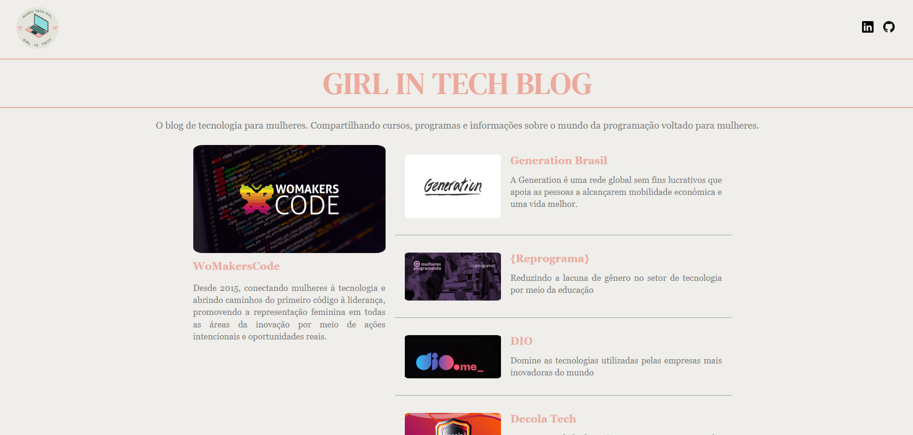
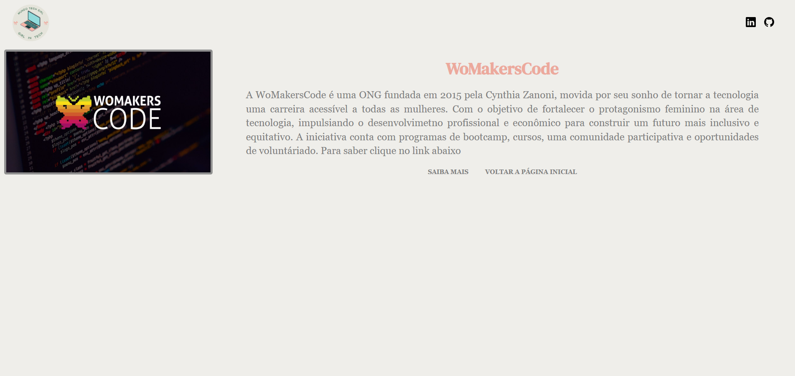

# AngularBlog

Essse projeto foi desenvolvido com a framework [Angular CLI](https://github.com/angular/angular-cli) version 14.1.2.

## Servidor de desenvolvimento

Run `ng serve` para um novo servidor de desenvolvimento. Navegue até `http://localhost:4200/`. O aplicativo será recarregado automaticamente se você alterar qualquer um dos arquivos de origem.

## Resultado do desenvolvimento

Disponível em: https://angular-blog-dio-five.vercel.app/

- página home:

- página da postagem:

